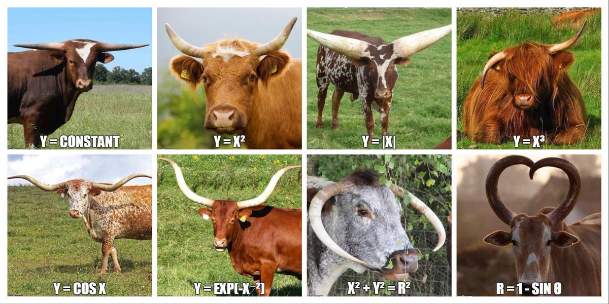

```{r setup, include=FALSE}

knitr::opts_chunk$set(message = F, warning = F)
options(digits = 3)

```

```{r dataprep, include=FALSE}

library(tidyverse)
# library(ggtextures)
library(magick)
library(rsvg)
library(plotly)
library(skimr)
library(usmap)
library(lubridate)

# Reading in and skimming the CSV file

milk_data <- read_csv("./files/dairy/dairy_performance.csv")


```

## Introduction

The data set we selected for our analysis is a collection of aggregated milk production and herd data from actual dairy farms across the United States. The data was provided by a dairy nutrition consulting company in Omaha, NE, who as part of their services, collects and analyzes dairy records to help inform producer decisions.  The data originates at the farm level from monthly "tests", where the milk production and milk component data (fat and protein %) from individual cows are measured and stored on various herd management software platforms owned by the dairies.  These data are then collected by the nutrition consulting company and are summarized into reports for individual herds.

According to the dairy nutrition consulting company, the data has rarely been assessed on a grand scale (i.e. all analyses have previously been conducted at the herd level).  Therefore, our group was chiefly interested in exploring the data set in its entirety, drawing comparisons in milk production performance between breeds of cows, state in which the milk is produced, and milk production over time.  

## Description of Dataset

https://www.dropbox.com/s/p83hoqvs03byonw/dairy_performance.csv?dl=0

The data was collected over a period of six years from commercial dairy farms (2016 - 2021) in 16 states.  There are a number of performance metrics listed in the data set as related to dairy production (milk yield, fat and protein percent, etc.) as well as herd dynamics and reproduction statistics.  The variables our group was primarily interested in are described below:

* HERD NAME: Anonymised listing of herds (to protect producer privacy)
* STATE: State abbreviation (U.S.A.)
* BREED:  Breed type of dairy cow
* TOTAL COWS:  Total cows in the herd, including lactating and non-lactating
* COWS IN MILK:  Total lactating cows in the herd
* MILK HERD:  Average pounds of milk per cow per day
* FAT PERCENT: Fat percent in milk
* PROTEIN PERCENT:  Protein percent in milk
* FAT AND PROTEIN:  Pounds of fat and protein in milk per head per day
* ENERGY CORRECTED MILK:  Milk pounds per cow per day corrected for fat and protein energy equivalent
* SOMATIC CELL COUNT HERD:  Count of somatic cell x1000 in milk per cow per day
* DAYS IN MILK:  Average days lactating of the herd
* MILK LACTATION ONE:  Average milk per cow per day for cows in 1st lactation (2 years old)
* INVERSION:  Percent of lactating cows where protein percent is greater than fat
* EVALUATION DATE:  Date of the farm observation in format Month, Day, Year

## Topics Explored

Overall, our team attempted to draw conclusions from the data set regarding factors that may influence milk production, including breed of cow, region of the U.S., and the time of the year.

Specifically, we analyzed:

1.	Milk production depending on the Breed among the farms
2.	The relationships between milk production and Breed across regions 
3.	The relationships between milk production and Breed across time
4.	Fat and protein production depending on Breed
5.  Milk production by state
6.  Milk production across time


## Description of Analysis

### Data Cleaning

The first step in our analysis was to read in the data.  The data was stored in a CSV file, so we used the readr package to import the data.  Additionally, we used the skimr package to help us understand the data set at a glance.  The skimr package provided some useful insight, particularly regarding data cleaning that would be necessary in the subsequent steps.  For example, skimr highlighted missing data that would need to be addressed in our analysis.

```{r}

# skim(milk_data)

```


As one goal of our analysis was to compare milk production by region of the U.S., regions had to be assigned to states listed in the data set (regions were not originally included in the data set).  The regions assigned were as defined by the dairy nutrition consulting company and pertain to the demarcation of the geography covered by their consulting teams.  The dplyr package was utilized here so that the mutate function could be used to add the additional column of regions.


```{r}  

# Creating 'regions' variable

milk_data <- milk_data %>%
  mutate(region = STATE)
# Assigning states to Pacific Northwest (PNW))
milk_data$region[milk_data$region == "ID"] <- "PNW"
milk_data$region[milk_data$region == "UT"] <- "PNW"
milk_data$region[milk_data$region == "WA"] <- "PNW"
milk_data$region[milk_data$region == "CA"] <- "PNW"
# Assigning states to High Plains (HP)
milk_data$region[milk_data$region == "CO"] <- "HP"
milk_data$region[milk_data$region == "TX"] <- "HP"
milk_data$region[milk_data$region == "NM"] <- "HP"
# Assigning states to Upper Midwest (UMW)
milk_data$region[milk_data$region == "IA"] <- "UMW"
milk_data$region[milk_data$region == "IL"] <- "UMW"
milk_data$region[milk_data$region == "MT"] <- "UMW"
milk_data$region[milk_data$region == "NE"] <- "UMW"
milk_data$region[milk_data$region == "WI"] <- "UMW"
milk_data$region[milk_data$region == "SD"] <- "UMW"
# Assigning states to Northeast (NE)
milk_data$region[milk_data$region == "NY"] <- "NE"
milk_data$region[milk_data$region == "PA"] <- "NE"
milk_data$region[milk_data$region == "VA"] <- "NE"

```


Next, the data were cleaned with the goals of our analyses in mind.  First, the lubridate package was used to modify the date format on which each milk test day occurred.  Previously, the date was listed in the format MON 00 (day) 0000 (year), which we adjusted to 0000-00-00 (year-month-day).  Second, we renamed the relevant variables to exclude any spaces and shorten names where possible.  Third, the select function was used to select only the columns that were relevant to our goals for the analysis.  Fourth, the relocate function was used to rearrange columns in a more logical order.  Finally, we determined that missing values were listed as 0s in the dat set, so we replaced these with NA so that R would understand these are missing data. 


```{r}
# Use mutate/lubridate to make datetime column (single column in format XXXX-XX-XX)

milk <- milk_data %>%
  mutate(date2=mdy(`EVALUATION DATE`))

# Cleaning data; renaming variables
milk_analysis <- milk %>%
  rename(herd = `HERD NAME`, state = STATE, breed = BREED, 
         total_cows = `TOTAL COWS`, cows_in_milk = `COWS IN MILK`, 
         milk_lbs = `MILK HERD`, fat_pct = `FAT PERCENT AVERAGE`, 
         protein_pct = `PROTEIN PERCENT AVERAGE`, 
         fat_protein_lbs = `FAT AND PROTEIN`, ecm = `ENERGY CORRECTED MILK`, 
         date = `EVALUATION DATE`) %>%

# Cleaning data; selecting relevant variables
  select(herd, state, breed, cows_in_milk, milk_lbs, fat_pct, 
         protein_pct, fat_protein_lbs, ecm, date2, region) %>%
  
# Cleaning data; rearranging variables  
  relocate(region, .after = state)

# Replace 0 values with 'NA'
milk_analysis[milk_analysis == 0] <- NA

```


### Milk Production by Breed

The first segment of the data we wished to explore was milk production dependent upon the breed of cow.  We found that the dairy cow breeds represented in our data set were Holstein, Jersey, Norwegian Red, Crossbred (combination of two or more breeds), and those that were not defined (NA).  We used the package ggplot2 to generate bar charts to compare average pounds of milk produced per day by each breed of cow.  We found that Holsteins produced the most milk on average (82.1 lbs/d) and that Jerseys produced the least amount of milk (62.3 lbs/d).

```{r}
#install.packages("processx")
#install.packages("devtools")
#devtools::install_github("clauswilke/ggtextures")


pictures <- tibble(
  breed = c("Jersey", "Crossbred", "Norwegian Red", "Holstein"),
  image = list(
    image_read("./images/dairy/Jersey.jpg"),
    image_read("./images/dairy/Crossbred.jpg"), 
    image_read("./images/dairy/NorwegianR.jpg"),
    image_read("./images/dairy/Holstein.jpg")
  )
)

# Plot of milk pounds by breed of cow
milk_lbs_breed <- milk_analysis %>%
  group_by(breed) %>%
  summarize(milk_lbs = mean(milk_lbs)) %>%
  left_join(pictures) %>%
  drop_na() %>%
  ggplot(aes(x=breed, y=milk_lbs, fill=breed, image = image)) +
  # geom_bar(stat = "identity") +
  scale_fill_manual(values=c("#800080","#3A3B3C", "#ECE5B6", "#C34A2C"))+
  geom_col(
    # img_height = NULL, img_width = grid::unit(1, "null"),
    # ncol = 1, nrow = 1, hjust = 1, vjust = 0.5
  ) +
  # guides(fill = "none") +
  # theme_minimal()+
  labs(title="Milk Pounds by Breed of Cow", x="Breed", y="Milk Pounds") 

ggplotly(milk_lbs_breed)

```

While we found that Holstein cows produced the most fluid milk, average milk pounds does not accurately represent the true value of the milk, as dairy producers are most often paid based on the component (fat and protein) composition of the milk.  Therefore, we chose to create a similar plot using the metric "Energy Corrected Milk", which standardizes fluid milk pounds as if all cows were producing 3.5% milk fat and 3.2% milk protein (fluid milk pounds based on equivalent energy needed to produce milk fat and milk protein over 3.5% and 3.2%, respectively). While we found that Holsteins continued to be the most productive breed (87.3 lb/d ECM), the gap between the other breeds was narrowed (i.e. 73.2 lb/d ECM from Jerseys) when milk component production was also considered.

```{r}
# Plot of energy corrected milk pounds by breed of cow

milk_lbs_ecm <- milk_analysis %>%
  group_by(breed) %>%
  summarize(ecm = mean(ecm, na.rm =T)) %>%
  left_join(pictures) %>%
  drop_na() %>%
  ggplot(aes(x=breed, y=ecm, fill=breed, image = image)) +
  # geom_bar(stat = "identity") +
  scale_fill_manual(values=c("#800080","#3A3B3C", "#ECE5B6", "#C34A2C"))+
  geom_col(
    # img_height = NULL, img_width = grid::unit(1, "null"),
    # ncol = 1, nrow = 1, hjust = 1, vjust = 0.5
  ) +
  guides(fill = "none") +
  # theme_minimal()+
  labs(title="Energy Corrected Milk Pounds by Breed of Cow", x="Breed", y="ECM Pounds") 

ggplotly(milk_lbs_ecm)

```

In order to further explore the concept of milk component differences between breeds, we also generated a bar chart that compared combined fat and protein pounds in the milk (calculated as milk fat % * milk pounds + milk protein % * milk pounds).  The chart was markedly similar to the ECM chart, suggesting that ECM is an appropriate metric for breed milk production comparisons, as milk fat and protein yield are accounted for.

```{r}

# Compare fat and protein production by breed
component_lbs <- milk_analysis %>%
  group_by(breed) %>%
  summarize(fat_protein_lbs = mean(fat_protein_lbs,na.rm =T)) %>%
  left_join(pictures) %>%
  drop_na() %>%
  ggplot(aes(x=breed, y=fat_protein_lbs, fill=breed, image = image)) +
  # geom_bar(stat = "identity") +
  scale_fill_manual(values=c("#800080","#3A3B3C", "#ECE5B6", "#C34A2C"))+
  geom_col(
    # img_height = NULL, img_width = grid::unit(1, "null"),
    # ncol = 1, nrow = 1, hjust = 1, vjust = 0.5
  ) +
  # guides(fill = "none") +
  # theme_minimal()+
  labs(title="Combined Fat and Protein Pounds by Breed of Cow", x="Breed", y="Fat and Protein Pounds") 

ggplotly(component_lbs)

```

While exploring breed differences, we noted that Jersey and Crossbred milk components were often greater than those of Holsteins, and, when milk fat % was high, protein % also appeared to be high.  Accordingly, we suspected there may be a relationship in the data between milk fat % and protein %.  To answer this question, we generated a scatterplot using ggplot2.  In addition, the summary function was used to determine a linear model of this relationship; the r^2 was relatively strong (0.578), suggesting that as milk fat % goes up in milk, so does milk protein %.  The line calculated was plotted through the data using geom_smooth.

```{r}
# Compare milk fat and protein percent relationship

# First calculating relationship including r^2

# summary(lm(formula = protein_pct ~ fat_pct, data = milk_analysis))

fat_protein_pct <- milk_analysis %>%
  ggplot(aes(x=fat_pct, y=protein_pct,)) +
  geom_point(stat = "identity", na.rm = FALSE) +
  geom_smooth(method = "lm",
              fromula = protein_pct ~ fat_pct) +
  labs(title="Relationship of Milk Fat and Protein Percent", x="Milk Fat, %", y="Milk Protein, %") +
  annotate("text", x = 6, y = 2.5, label = "y = 0.4032x + 1.6294, r^2 = 0.578")

print(fat_protein_pct)

```

### Milk Production by Region

The next segment of the data we wished to explore was regional comparisons of milk production.  The dairy nutrition consulting company that provided the data set operates in four distinct regions of the country: High Plains (HP), Northeast (NE), PNW (Pacific Northwest), and UMW (Upper Midwest).  As described in the data cleaning section, regions were not inherent to the dataset, so region was assigned based on state.  Because of the breed differences in milk we identified, we decided it would be best to compare regional milk production by breed; We used the dplyr package to filter by the desired breed, used goup_by to group the data into regions, and then the summarise function to calculate mean production.  Finally, we used ggplot2 and ggplotly to create interactive bar charts illustrating milk production by breed within region.

For Holstein cattle, we found that the UMW region had the highest average production (87.7 lb/d) and that the HP region had the lowest (76.3 lb/d).  For Jersey cattle, the NE region had the highest average production (68.4 lb/d) while the HP region had the lowest (58.1 lb/d).  For Crossbred cattle, the UMW averaged the highest (82.2 lb/d), while all other regions were in the low 70s (71.6 to 73.3 lb/d).  Norwegian Red cattle were only found in the HP region, so they were excluded from the analysis or regional comparisons.

```{r}
# Compare Holstein breed milk production by region

holstein_by_region <- milk_analysis %>%
  drop_na() %>%
  filter(breed=="Holstein") %>%
  group_by(region) %>%
  summarise(a=round(mean(cows_in_milk, na.rm=TRUE),1),
            milk_lbs=round(mean(milk_lbs, na.rm=TRUE),1),
            c=round(mean(fat_pct, na.rm=TRUE),1),
            d=round(mean(protein_pct, na.rm=TRUE),1),
            e=round(mean(fat_protein_lbs, na.rm=TRUE),1),
            f=round(mean(ecm, na.rm=TRUE),1))

holstein_by_region_plot <- holstein_by_region %>%
  ggplot(aes(x=region, y=milk_lbs, fill=region)) + geom_bar(stat="identity") +
  scale_fill_brewer() +
  # theme_dark() +
  labs(title="Holstein Milk Pounds by Region", x="Region", y="Milk Pounds") +
  ylim(0, 100)

ggplotly(holstein_by_region_plot)

```


```{r}
# Compare Jersey breed milk production by region

jersey_by_region <- milk_analysis %>%
    drop_na() %>%
  filter(breed=="Jersey") %>%
  group_by(region) %>%
  summarise(a=round(mean(cows_in_milk, na.rm=TRUE),1),
            milk_lbs=round(mean(milk_lbs, na.rm=TRUE),1),
            c=round(mean(fat_pct, na.rm=TRUE),1),
            d=round(mean(protein_pct, na.rm=TRUE),1),
            e=round(mean(fat_protein_lbs, na.rm=TRUE),1),
            f=round(mean(ecm, na.rm=TRUE),1))

jersey_by_region_plot <- jersey_by_region%>%
  ggplot(aes(x=region, y=milk_lbs, fill=region)) + geom_bar(stat="identity") +
  scale_fill_brewer() +
  # theme_dark() +
  labs(title="Jersey Milk Pounds by Region", x="Region", y="Milk Pounds") +
  ylim(0, 100)

ggplotly(jersey_by_region_plot)

```


```{r}
# Compare Crossbred breed milk production by region

crossbred_by_region <- milk_analysis %>%
    drop_na() %>%
  filter(breed=="Crossbred") %>%
  group_by(region) %>%
  summarise(a=round(mean(cows_in_milk, na.rm=TRUE),1),
            milk_lbs=round(mean(milk_lbs, na.rm=TRUE),1),
            c=round(mean(fat_pct, na.rm=TRUE),1),
            d=round(mean(protein_pct, na.rm=TRUE),1),
            e=round(mean(fat_protein_lbs, na.rm=TRUE),1),
            f=round(mean(ecm, na.rm=TRUE),1))

crossbred_by_region_plot <- crossbred_by_region %>%
  ggplot(aes(x=region, y=milk_lbs, fill=region)) + geom_bar(stat="identity") +
  scale_fill_brewer() +
  # theme_dark() +
  labs(title="Crossbred Milk Pounds by Region", x="Region", y="Milk Pounds") +
  ylim(0, 100)

ggplotly(crossbred_by_region_plot)

```


In addition to the bar charts above, we also chose to plot the regional Holstein (most common breed in our data set) production data as a histogram in order to visualize the distribution of milk production levels between regions, as well as the number of herds represented in the data set.  The histogram does a nice job of illustrating that the PNW and UMW regions achieved the greater average milk production compared to the NE and HP regions.

```{r}
# use individual data rather than average only
# http://www.sthda.com/english/wiki/colors-in-r

milk_histrogram <- milk_analysis %>%
  filter(breed=="Holstein" & region %in% c("PNW", "UMW")) %>%
  ggplot(aes(x=milk_lbs)) + 
  geom_histogram(aes(color=region), 
                 binwidth = 1, position = "identity", alpha=.1) +
  geom_histogram(data=subset(milk_analysis, (breed=="Holstein" & region =="NE")),
                 aes(fill=region), 
                 binwidth = 1, position = "identity", alpha=.5) +
  geom_histogram(data=subset(milk_analysis, 
                             (breed=="Holstein" & !region %in% c("PNW", "UMW", "NE"))),
               aes(fill=region), 
               binwidth = 1, position = "identity", alpha=.5) +
  # scale_color_manual(values=c("#FFCCFF", "#FF9933")) +
  scale_fill_manual(values=c("#6666FF", "#CCFF99"), guide="none") +
  # guides(fill=F, color=F) +
  labs(title="Holstein Milk Pounds by Region", x="Milk Pounds", y="Count of Holstein cows")  

# milk_histrogram
p1<-plotly_build(milk_histrogram)
p1$x$data[[1]]$name <- "PNW"
p1$x$data[[2]]$name <- "UMW"
p1$x$data[[3]]$name <- "NE"
p1$x$data[[4]]$name <- "HP"
p1$x$data[[5]]$name <- "NA"
p1

```


Next, we chose to dig deeper into the regional data to make milk production comparisons by state.  The usmap package was utilized along with ggplot2 and ggplotly to generate an interactive map of the U.S. that illustrates milk production averages by state.  As noted in the description of the histogram above, the overwhelming majority of dairy records originated from the PNW and UMW region, so we also generated a U.S. map illustrating the number of cows tested from each state so as not to mislead our readers when interpreting milk averages by state (i.e. Nebraska and Virginia showed the highest average milk production, but were on the lower end of the spectrum for total cows tested).  Notwithstanding, a bar chart was also generated to rank states on average milk production from this data set in ascending order.

```{r}
# Visualize milk production by state

milk_by_state <- milk_analysis %>%
  group_by(state) %>%
  summarise(a=round(mean(cows_in_milk, na.rm=TRUE),1),
            milk_lbs=round(mean(milk_lbs, na.rm=TRUE),1),
            c=round(mean(fat_pct, na.rm=TRUE),1),
            d=round(mean(protein_pct, na.rm=TRUE),1),
            e=round(mean(fat_protein_lbs, na.rm=TRUE),1),
            f=round(mean(ecm, na.rm=TRUE),1))

milk_by_state_viz <-  subset(milk_by_state, !is.na(state)) %>%
    plot_usmap(data= ., values = "milk_lbs", labels = TRUE) +
  scale_fill_gradient(low = "white", high = "red", name = NULL) +
  ggtitle("Average Milk Production (lbs) by State")

ggplotly(milk_by_state_viz)

```

```{r}
# Visualize cow numbers in dataset by state

cows_by_state <- milk_analysis %>%
  group_by(state) %>%
  summarise(cows_in_milk=round(sum(cows_in_milk, na.rm=TRUE),1),
            b=round(mean(milk_lbs, na.rm=TRUE),1),
            c=round(mean(fat_pct, na.rm=TRUE),1),
            d=round(mean(protein_pct, na.rm=TRUE),1),
            e=round(mean(fat_protein_lbs, na.rm=TRUE),1),
            f=round(mean(ecm, na.rm=TRUE),1))

cows_by_state_viz <- subset(cows_by_state, !is.na(state)) %>%
  plot_usmap(data=., values = "cows_in_milk", labels = TRUE) +
  scale_fill_gradient(low = "white", high = "blue", name = NULL) +
  ggtitle("Total Cows Tested by State")

ggplotly(cows_by_state_viz)

```

```{r}
# Compare milk production by state

milk_by_state <- milk_analysis %>%
  group_by(state) %>%
  summarise(a=round(mean(cows_in_milk, na.rm=TRUE),1),
            milk_lbs=round(mean(milk_lbs, na.rm=TRUE),1),
            c=round(mean(fat_pct, na.rm=TRUE),1),
            d=round(mean(protein_pct, na.rm=TRUE),1),
            e=round(mean(fat_protein_lbs, na.rm=TRUE),1),
            f=round(mean(ecm, na.rm=TRUE),1))

milk_by_state_plot <- subset(milk_by_state, !is.na(state)) %>%
  mutate(state=reorder(state, milk_lbs)) %>%
  ggplot(aes(x=state, y=milk_lbs, fill=state)) + 
  geom_bar(stat="identity") +
  labs(title="Milk Pounds by State", x="State", y="Milk Pounds") 

ggplotly(milk_by_state_plot)

```


### Milk Production Across Time

For the last segment of our analysis, we wished to explore milk production by time.  We first chose to plot average milk production for all breeds combined for the entire period over which the data was collected (2016 - 2021).  A couple interesting trends emerged.  Firstly, there are clear peaks and valleys as one looks across the data from 2016 - 2021; it is evident that milk production is highest in the Winter and Spring months, and then drops off sharply in the Summer -- this is likely due to heat stress experienced by cows in most regions of the U.S.  Secondly, the overall trend in milk production appears to be increasing slightly over the 5 year period, particularly with increasing "low" points.

Next, we generated similar plots over time for individual breeds.  Not surprisingly, the Holstein chart followed similarly to the the overall chart, as Holsteins were the predominant breed in the data set.  Interestingly, the Jersey plot did not have as pronounced peaks and valleys across time as did the Holsteins and Crossbred, suggesting they may be more resistant to the effects of heat stress on milk production.  The Jersey and Crossbred plots appeared to generally trend down over the 5 year period, while Holstein milk production appeared to increase.  Norwegian Reds were excluded from this analysis, as they only appeared on three test days in the entire data set.


```{r}
# Milk across time

milk_by_time <- milk_analysis
milk_by_time$date2 <- as.Date(milk_by_time$date2)

milk_by_time$Month <- months(milk_by_time$date2)
# milk_by_time$Year <- format(milk_by_time$date2,format="%y")
milk_by_time$Year <- format(milk_by_time$date2,format="%Y")
# milk_by_month <- aggregate(milk_lbs ~ Month + Year, milk_by_time, mean, na.rm=TRUE)

milk_by_month2 <- aggregate(milk_lbs ~ Month + Year, milk_by_time, mean, na.rm=TRUE) %>%
  mutate(date=as.Date(paste("01", Month, Year, sep = "-"), format = "%d-%b-%Y"))

# milk_by_month_plot <- milk_by_month %>%
#   unite(year_month,Year,Month) %>%
#   group_by(year_month) %>%
#   summarise(a=round(mean(milk_lbs, na.rm=TRUE),1))
# 
# ggplot(data=milk_by_month_plot, aes(x=year_month, y=a)) + geom_bar(stat = "identity") +
#   scale_x_discrete(guide = guide_axis(check.overlap = TRUE)) +
#   labs(title="Milk Production Across Time", x="Date", y="Milk Pounds") 

# Most basic bubble plot
p <- ggplot(milk_by_month2, aes(x=date, y=milk_lbs)) +
  geom_line(color="#69b3a2") +
  geom_point() +
  geom_smooth() +
  # ylim(50,85) +
  scale_x_date(date_breaks = "6 month", date_labels = "%b %Y",
               limit=c(as.Date("2017-01-01"),max(milk_by_month2$date))) +
  scale_color_manual(values = "#f8766d") +
  theme(axis.text.x = element_text(angle=45, vjust=0.6)) +
  labs(title="Milk across time (overall)",  y="milk (lbs)", x="date")

ggplotly(p)
```


```{r}
# Milk production by Holsteins across time

milk_by_time_holstein <- milk_analysis %>%
  filter(breed=="Holstein")
  
milk_by_time_holstein$date2 <- as.Date(milk_by_time_holstein$date2)

milk_by_time_holstein$Month <- months(milk_by_time_holstein$date2)
# milk_by_time_holstein$Year <- format(milk_by_time_holstein$date2,format="%y")
milk_by_time_holstein$Year <- format(milk_by_time_holstein$date2,format="%Y")
# milk_by_time_holstein <- aggregate(milk_lbs ~ Month + Year, milk_by_time_holstein, mean, na.rm=TRUE)

milk_by_time_holstein2 <- aggregate(milk_lbs ~ Month + Year, milk_by_time_holstein, mean, na.rm=TRUE) %>%
  mutate(date=as.Date(paste("01", Month, Year, sep = "-"), format = "%d-%b-%Y"))


# Most basic bubble plot
p <- ggplot(milk_by_time_holstein2, aes(x=date, y=milk_lbs)) +
  geom_line(color="#FF9933") +
  geom_point() +
  geom_smooth() +
  # ylim(50,85) +
  scale_x_date(date_breaks = "6 month", date_labels = "%b %Y", 
               limit=c(as.Date("2017-01-01"),max(milk_by_time_holstein2$date))) +
  theme(axis.text.x = element_text(angle=45, vjust=0.6)) +
  labs(title="Milk across time (Holstein)",  y="milk (lbs)", x="date")

ggplotly(p)

```

```{r}
# Milk production by Jerseys across time

milk_by_time_jersey <- milk_analysis %>%
  filter(breed == "Jersey")

milk_by_time_jersey$date2 <- as.Date(milk_by_time_jersey$date2)

milk_by_time_jersey$Month <- months(milk_by_time_jersey$date2)
# milk_by_time_jersey$Year <- format(milk_by_time_jersey$date2,format="%y")
milk_by_time_jersey$Year <- format(milk_by_time_jersey$date2,format="%Y")
# milk_by_time_jersey <- aggregate(milk_lbs ~ Month + Year, milk_by_time_jersey, mean, na.rm=TRUE)

milk_by_time_jersey2 <- aggregate(milk_lbs ~ Month + Year, milk_by_time_jersey, mean, na.rm=TRUE) %>%
  mutate(date=as.Date(paste("01", Month, Year, sep = "-"), format = "%d-%b-%Y"))


# Most basic bubble plot
p <- ggplot(milk_by_time_jersey2, aes(x=date, y=milk_lbs)) +
  geom_line(color="firebrick") +
  geom_point() +
  geom_smooth() +
  # ylim(50,85) +
  scale_x_date(date_breaks = "6 month", date_labels = "%b %Y") +
  theme(axis.text.x = element_text(angle=45, vjust=0.6)) +
  labs(title="Milk across time (Jersey)",  y="milk (lbs)", x="date")

ggplotly(p)
```

```{r}
# Milk production by Crossbred across time

milk_by_time_crossbred <- milk_analysis %>%
  filter(breed == "Crossbred")

milk_by_time_crossbred$date2 <- as.Date(milk_by_time_crossbred$date2)

milk_by_time_crossbred$Month <- months(milk_by_time_crossbred$date2)
# milk_by_time_crossbred$Year <- format(milk_by_time_crossbred$date2,format="%y")
milk_by_time_crossbred$Year <- format(milk_by_time_crossbred$date2,format="%Y")
# milk_by_time_crossbred <- aggregate(milk_lbs ~ Month + Year, milk_by_time_crossbred, mean, na.rm=TRUE)

milk_by_time_crossbred2 <- aggregate(milk_lbs ~ Month + Year, milk_by_time_crossbred, mean, na.rm=TRUE) %>%
  mutate(date=as.Date(paste("01", Month, Year, sep = "-"), format = "%d-%b-%Y"))


# Most basic bubble plot
p <- ggplot(milk_by_time_crossbred2, aes(x=date, y=milk_lbs)) +
  geom_line(color="steelblue") +
  geom_point() +
  geom_smooth() +
  # ylim(50,85) +
  scale_x_date(date_breaks = "6 month", date_labels = "%b %Y") +
  theme(axis.text.x = element_text(angle=45, vjust=0.6)) +
  labs(title="Milk across time (Crossbred)",  y="milk (lbs)", x="date")

ggplotly(p)

```


## Conclusion

The data provided by the dairy consulting company offered a unique opportunity to explore a LARGE data set from the animal agriculture sector.  As the company's primary focus for the data has been herd level evaluation, we believe our analysis provides useful insight into the data as a whole, allowing for comparisons of regional and breed performance for the company's clients.

In our analysis, we identified that Holsteins were the most productive breed in the data set in terms of milk and component yield, and that farms in the Upper Midwest region produced the most milk on average over the last 6 years.  We also demonstrated the importance of milk component yield when making breed comparisons, as well as the clear relationship between milk fat and protein %.  Finally, we identified seasonally-affected milk production trends across time, as well as an apparent trend for increased milk production overall.
