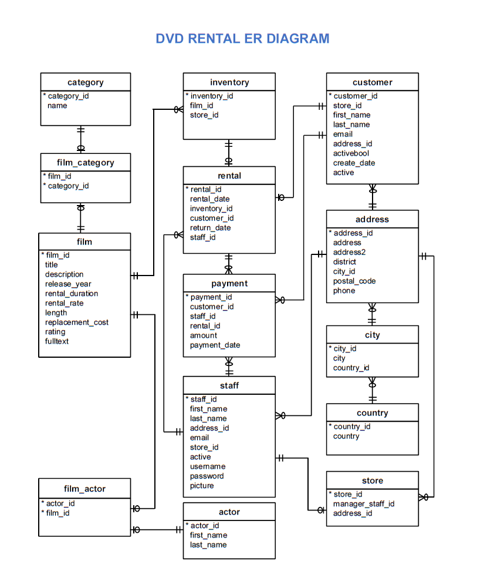

 <br>


```{r setup, include=FALSE}
knitr::opts_chunk$set(echo = TRUE)
knitr::opts_chunk$set(dpi = 300)
knitr::opts_chunk$set(warning = FALSE)
knitr::opts_chunk$set(message = FALSE)
# knitr::opts_chunk$set(fig.width=10)

```

```{r packages}
library(RPostgreSQL)
library(RPostgres)
library(flextable)
library(tidyverse)
library(officer)
library(wesanderson)

```

```{r, include=FALSE}
pw <- "Handong!23"

```

```{r dataprep}
con <- dbConnect(RPostgres::Postgres(),
                 host='localhost',
                 port='5432',
                 dbname='dvdrental',
                 user='postgres',
                 password=pw)
rm(pw) # removes the password

formats <- list(
  "dod" = function(x) ifelse(is.na(x), x, sprintf("%.0f%%", x)),
  "current_day" = function(x) ifelse(is.na(x), x, sprintf("$%.0f", x)),
  "prev_day" = function(x) ifelse(is.na(x), x, sprintf("$%.0f", x)),
  "film_revenue" = function(x) ifelse(is.na(x), x, sprintf("$%.0f", x)),
  "film_revenue_pct" = function(x) ifelse(is.na(x), x, sprintf("%.0f%%", x))
  )

std_border = fp_border(color="gray")

flextables <- function(data){
    headers <- tibble(col_keys = colnames(data),
                  line1 = colnames(data) %>%
                  recode(
                      "actor_category" = "Category",
                      "count" = "Count",
                      "watcher_category" = "Category",
                      "film_id" = "Film ID",
                      "film_revenue" = "Total revenue ($)",
                      "film_revenue_pct" = "Total revenue (%)",
                      "store_id" = "Store ID",
                      "date" = "Date",
                      "current_day" = "Daily revenue",
                      "prev_day" = "Lag-1 revenue",
                      "dod" = "DoD growth"
                  )
                  )
    flextable(data) %>%
    {rlang::inject(set_formatter(., !!! formats))} %>%
    set_header_df(mapping = headers, key = "col_keys") %>%
    theme_booktabs() %>%
    hline(part="body", border = std_border ) %>%
    autofit()
}

```


## Database overview


**Description** 

The Sakila Database holds information about a company that rents movie DVDs.
For this project, we will be querying the database to gain an understanding of the customer base, such as what the patterns in movie watching are across different customer groups, how they compare on payment earnings, and how the stores compare in their performance.

And here is the Entity-relationship (ER) diagram for the DVD Rental database is provided below.




**Tables**

* `actor` : contains actors data including first name and last name
* `film` : contains films data such as title, release year, length, rating, etc
* `film_actor` : contains the relationships between films and actors
* `category` : contains film’s categories data
* `film_category` : containing the relationships between films and categories
* `store` : contains the store data including manager staff and address
* `inventory` : stores inventory data
* `rental` : stores rental data
* `payment` : stores customer’s payments
* `staff` : stores staff data
* `customer` : stores customer’s data
* `address` : stores address data for staff and customers
* `city` : stores the city names
* `country` : stores the country names


**Source**

[Sakila Sample Database](https://dev.mysql.com/doc/sakila/en/)

<br>

## Practice Questions

### Question 13

> Please write a query to return the number of actors whose first name starts with 'A', 'B', 'C', or others. The order of your results doesn't matter. You need to return 2 columns:

* First column: a group of actors based on the first letter of their first_name, use
the following: `a_actors`, `b_actors`, `c_actors`, `other_actors` to represent their groups.
* Second column: the number of actors whose first name matches the pattern.

```{r}
q13_dataframe <- dbGetQuery(con, 
"with cte1 as (
	select *, case 
		when first_name like 'A%' then 'a_actors'
		when first_name like 'B%' then 'b_actors'
		when first_name like 'C%' then 'c_actors'
		else 'other_actors'
		end as actor_category
	from actor a
)
select actor_category, count(*)
from cte1
group by actor_category
order by actor_category
;"
)

flextables(q13_dataframe)

q13_dataframe %>% mutate(count = as.integer(count)) %>%
    ggplot(aes(x=actor_category, y=count, 
               label=count, vjust=-0.5)) +
    geom_col(fill = "#01a08a") +
    scale_y_continuous(expand = expansion(mult = c(0, .2))) +
    xlab("Category") +
    ylab("Count") +
    geom_text()
    

```


### Question 15

> Please write a query to return the number of fast movie watchers vs slow movie watchers. The orders of your results doesn't matter. A customer can only rent one movie per transaction.

* fast movie watcher: by average return their rentals within 5 days.
* slow movie watcher: takes an average of >5 days to return their rentals.
* Most customers have multiple rentals over time, you need to first compute the number of days for each rental transaction, then compute the average on the rounded up days. (e.g., if the rental period is 1 day and 10 hours, count it as 2 days.)
* Skip the rentals that have not been returned yet (e.g., rental_date IS NULL)


```{r}
q15_dataframe <- dbGetQuery(con, 
"with cte1 as (
	select *, return_date - rental_date as rental_period 
	from rental
),
cte2 as (
	select *, extract(days from rental_period)+1 as rental_days
	from cte1
),
cte3 as (select customer_id, avg(rental_days) avg_rental
	from cte2
	where rental_days is not null
	group by customer_id
)
,
cte4 as (
	select *, case 
	when avg_rental > 5 then 'slow movie watcher'
	else 'fast movie watcher'
	end watcher_category
	from cte3
--;
)
select watcher_category, count(customer_id)
from cte4
group by watcher_category
;
"
)

flextables(q15_dataframe)

q15_dataframe %>% mutate(count = as.integer(count)) %>%
    ggplot(aes(x=watcher_category, y=count, 
               label=count, vjust=-0.5)) +
    geom_col(fill = c("#ff8b00", "#92f08f")) +
    scale_y_continuous(expand = expansion(mult = c(0, .2))) +
    xlab("Category") +
    ylab("Count") +
    geom_text()

```


### Question 58 

> Write a query to return the percentage of revenue for each of the following
films: film_id <= 10

* Formula: revenue (film_id x) * 100.0/ revenue of all movies
* The order of your results doesn't matter

```{r}
q58_dataframe <- dbGetQuery(con, 
"with cte1 as (
    select distinct film_id, 
    sum(amount) over(partition by film_id) film_revenue
    from payment p
    left join rental r 
    using (rental_id)
    left join inventory i 
    using (inventory_id)
    where film_id <= 10
)
select *, 
    film_revenue *100.0 / sum(film_revenue) over() film_revenue_pct
    from cte1
    order by film_id
;")

flextables(distinct(q58_dataframe))

distinct(q58_dataframe) %>%
    ggplot(aes(x=film_id, y=film_revenue, 
               label=sprintf("$%.0f", film_revenue), vjust=-0.5)) +
    geom_col(fill = "steelblue") +
    scale_x_continuous(breaks=seq(1, 10, 1)) +
    scale_y_continuous(expand = expansion(mult = c(0, .2))) +
    xlab("Film ID") +
    ylab("Total revenue ($)") +
    geom_text()
    

```


### Question 80 

> Please write a query to return DoD(day over day) growth for each store from April 24, 2007 (inclusive) to April 31, 2007 (inclusive).


* `DoD`: (current_day/ prev_day -1) * 100.0
* Multiply dod growth to 100.0 to get percentage of growth
* Use ROUND to convert dod growth to the nearest integer


```{r}

q80_dataframe <- dbGetQuery(con, 
"with cte1 as(
    select store_id, 
    date(payment_date) date,
    sum(amount) current_day
    from payment p 
    left join rental r 
    using (rental_id)
    left join inventory i 
    using (inventory_id)
    where payment_date >= '2007-04-01' and payment_date <= '2007-04-30'
    group by store_id, date(payment_date)
),
cte2 as (
    select *, lag(current_day) over(partition by store_id order by date) prev_day
    from cte1
)
select *, round((current_day/prev_day-1)*100.0) DoD
from cte2
;"
)

flextables(q80_dataframe) %>%
    merge_v(j = c("store_id")) %>%
    valign(j = c("store_id"), valign = "top")

```


